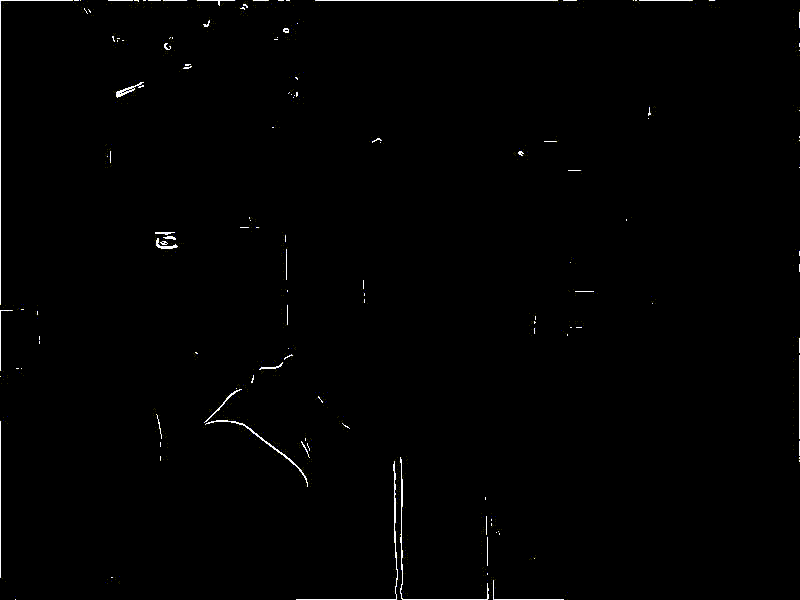

# sgm_ed
Edge detection using the squared gradient magnitude (SGM). SGM was acquired using an x sobel mask and a y sobel mask. 

### Running
```
./sgm_ed
```

### Dependencies
opencv4, v4l2, ffmpeg

### Example Output

